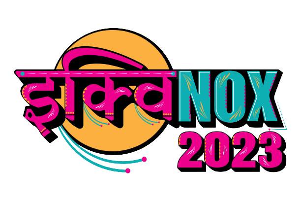

<h1 align="center">
   
  Equinox 2023
</h1>

Equinox, the techno-cultural fest organized by IIIT Lucknow is back with its fourth edition. Celebrating the coder, the reader, the learner, and the leader, Equinox provides them a platform to showcase their ideas and build upon them, to morph their unrelenting imagination into a reality. This time all your joy, excitement, and thriller will be quadrupled as we are back with many more fun exciting contests for all students, experts, and beginners to code, learn and experience the wonders of technology.

Equinox will take you on a 3-day journey filled with adventurous and educational events that will drive you to think outside the box and leave you with a hue of reminiscent memories. To participate in fest events you must be 18 years of age. For any queries, you can contact a team member.

